## ⚙️ Skills & Tools

<table align="center">
<tr>
<tr>
<td valign="top" width="16%"><b>Languages</b></td>
<td>

</td>
</tr>
<tr>
<td valign="top"><b>Frontend & Mobile</b></td>
<td>

</td>
</tr>
<tr>
<td valign="top"><b>Backend & APIs</b></td>
<td>

</td>
</tr>
<tr>
<td valign="top"><b>Databases</b></td>
<td>

</td>
</tr>
<tr>
<td valign="top"><b>Cloud & DevOps</b></td>
<td>

</td>
</tr>
<tr>
<td valign="top"><b>AI/ML</b></td>
<td>

</td>
</tr>
<tr>
<td valign="top"><b>Tools & Methodologies</b></td>
<td>

</td>
</tr>